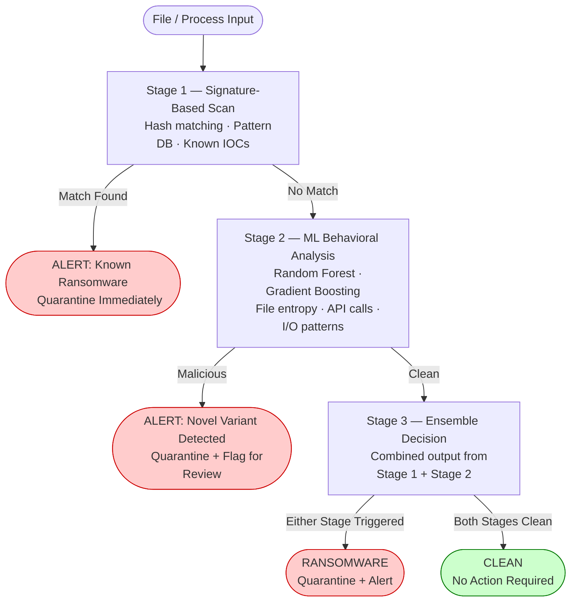

# Ransomware Detection Survey — Hybrid Detection Model

**Author:** Mahalakshmi Karthikeyan

---

## 1. Problem Statement

Ransomware attacks have become one of the most destructive cybersecurity threats, encrypting victim data and demanding ransom payments. They target governments, healthcare facilities, and businesses of all sizes, causing severe operational and financial damage.

Despite advances in detection technology, no single approach handles the full threat landscape:

- **Signature-based detection** is fast and precise but completely blind to new and polymorphic ransomware variants it has never seen before
- **Behavioral detection** catches unknown variants but generates high false positive rates that make it unsustainable in real-world environments
- **Machine learning models** improve adaptability but struggle with real-time detection speed and require large, current labeled datasets

The result is a persistent detection gap — particularly against novel variants — that existing standalone systems cannot close.

---

## 2. Objectives

- Survey 20 peer-reviewed ransomware detection studies across signature-based, behavioral, and ML approaches
- Identify the structural failure modes of each detection paradigm through comparative analysis
- Propose a hybrid detection model that combines all three approaches to address the gaps no single method can cover
- Evaluate the proposed model against established detection methods in terms of accuracy, false positive rate, and real-time capability
- Identify future directions for AI-driven ransomware defense

---

## 3. Dataset Description

This is a research survey — detection performance data was drawn from 20 peer-reviewed papers published between 2018 and 2024, sourced from IEEE Xplore, ACM Digital Library, and Springer. No single dataset was used across all studies; the surveyed papers collectively analyzed the following types of data:

| Data Type | What It Captures |
|---|---|
| File system activity logs | Mass rename operations, extension changes, encryption events |
| API call sequences | System calls associated with file encryption and ransomware execution |
| Network traffic data | C2 communication patterns, unusual outbound connections |
| Static file features | PE header structure, file entropy, import table composition |
| Behavioral traces | Runtime process activity, registry modifications, shadow copy deletion |

Papers reviewed span detection across endpoint environments, cloud infrastructure, IoT, and network-based monitoring contexts.

---

## 4. Project Architecture

The proposed hybrid model operates in three sequential stages:

| Stage | Method | Role |
|---|---|---|
| Stage 1 | Signature-Based Scan | Rapidly eliminates known threats before ML inference runs |
| Stage 2 | ML Behavioral Classification | Detects novel and zero-day variants through pattern analysis |
| Stage 3 | Ensemble Decision | Flags if either stage triggers — minimizes missed detections |

---

## 5. Methodology

**Survey approach:** 20 peer-reviewed papers were selected based on three criteria — direct relevance to ransomware detection, empirical evaluation against detection datasets, and coverage of at least one of the three core detection paradigms.

**Analytical framework:** Each paper was evaluated across: what the approach detects reliably, where it fails structurally, and what operational constraints were noted or omitted by the authors.

**Why a hybrid approach?** Analysis across all 20 papers revealed a consistent pattern — every standalone method had a ceiling it could not break through. Signature methods hit that ceiling with novel variants. Behavioral methods hit it with false positive rates. ML methods hit it with real-time latency and dataset currency. The hybrid model is the only design that simultaneously addresses all three ceilings by combining the fast pre-filtering of signatures, the adaptability of ML, and an ensemble decision layer that reduces the risk of missed detections.

---

## 6. Model Training

This research proposes a detection model architecture; it does not conduct original ML training experiments. The following algorithms were analyzed across the 20 reviewed papers to determine the best fit for the Stage 2 ML classifier:

| Algorithm | Typical Detection Rate | False Positive Rate | Real-Time Viable | Selected |
|---|---|---|---|---|
| Random Forest | 95–99% | Low–Moderate | Yes | Primary |
| Gradient Boosting | 96–99% | Low | Yes | Alternative |
| Support Vector Machine | 91–97% | Moderate | Degrades at scale | No |
| Decision Tree (single) | 88–95% | Moderate–High | Yes | No |
| Deep Neural Network | 93–99% | Low | Limited | No |

**Random Forest** was selected as the primary Stage 2 classifier based on its consistent performance across reviewed studies, fast inference speed, and feature importance output — which helps explain individual detections. **Gradient Boosting** is the recommended alternative when minimizing false positives is the higher operational priority.

**Key features used for classification across reviewed studies:**

- File entropy (high entropy indicates active encryption)
- File rename and extension change rate
- API call sequences linked to ransomware behavior
- Registry modification patterns
- Network communication anomalies

---

## 7. Results

Performance metrics reported across the 20 surveyed papers, and projected performance of the proposed hybrid model:

| Detection Method | Detection Rate | False Positive Rate | Novel Variant Coverage | Real-Time Capable |
|---|---|---|---|---|
| Signature-Based | ~99% (known only) | Very Low | None | Yes |
| Behavioral / Heuristic | 85–93% | High | Yes | Limited |
| ML — Random Forest | 95–99% | Low–Moderate | Partial | Yes |
| ML — Gradient Boosting | 96–99% | Low | Partial | Yes |
| ML — Deep Learning | 93–99% | Low | Partial | No (resource-heavy) |
| **Hybrid (Proposed)** | **97–99%+** | **Low** | **Full** | **Yes** |

> Detection rates are drawn from empirical results reported in the 20 reviewed papers. The hybrid model projection is based on combining signature-based certainty for known threats with ML generalization for novel variants.

**Key metrics identified as most important for ransomware detection:**

- **Detection Rate** — percentage of ransomware correctly identified
- **False Positive Rate** — how often legitimate activity is incorrectly flagged; directly impacts operational sustainability
- **Novel Variant Coverage** — whether the system detects threats it has never seen before
- **Real-Time Processing** — whether detection keeps pace with actual file operation speed

**Core finding:** The hybrid model is the only approach that achieves high detection rates across both known and novel variants simultaneously while maintaining operationally sustainable false positive rates and real-time performance.

---

## How to Navigate This Repo

Start here with the README. For the technical deep dive on each detection method go to `analysis/`. To understand the proposed model architecture in detail go to `model/`. The full research paper is in `docs/`.

---

## What I Found Interesting

Most detection research optimizes for a single metric — usually accuracy — without accounting for the operational environment the system would actually run in. A model with 98% accuracy that introduces latency or floods analysts with false positives will not be used effectively in practice. The hybrid approach stood out not just because it performed better technically, but because it is the only design that holds up when you think about it as something that has to run at scale in a real environment.

---

## 8. Future Enhancements

- Integration of AI-driven adaptive learning to improve detection of continuously evolving ransomware families
- Extension of the hybrid model to cloud-native environments where file operations occur at API level rather than OS level
- Blockchain-based audit trail integration for forensic traceability of detection events
- Evaluation of the proposed architecture against live ransomware datasets for empirical performance validation
- Reducing computational overhead of ML inference for deployment in resource-constrained and IoT environments

---

## 9. References

20 peer-reviewed papers reviewed — full annotated list available in [`references/annotated_references.md`](references/annotated_references.md)

Key sources include:

- Ferdous et al. (2024) — AI-Based Ransomware Detection: A Comprehensive Review — *IEEE Access*
- Ispahany et al. (2024) — Ransomware Detection Using Machine Learning: A Review — *IEEE Access*
- Smith et al. (2022) — Machine Learning Algorithms and Frameworks in Ransomware Detection — *IEEE Access*
- Ahmad et al. (2023) — Systematic Review of Ransomware Attack Detection in ML — *AiDAS Conference*
- Daku et al. (2018) — Behavioral-Based Classification of Ransomware Using ML — *IEEE TrustCom*

---

## Repository Contents

| Folder | Contents |
|---|---|
| `docs/` | Full research paper |
| `analysis/` | Detection method breakdown and comparative findings |
| `research/` | Survey methodology |
| `model/` | Hybrid architecture, pipeline diagram, and algorithm analysis |
| `references/` | All 20 papers with annotations |

