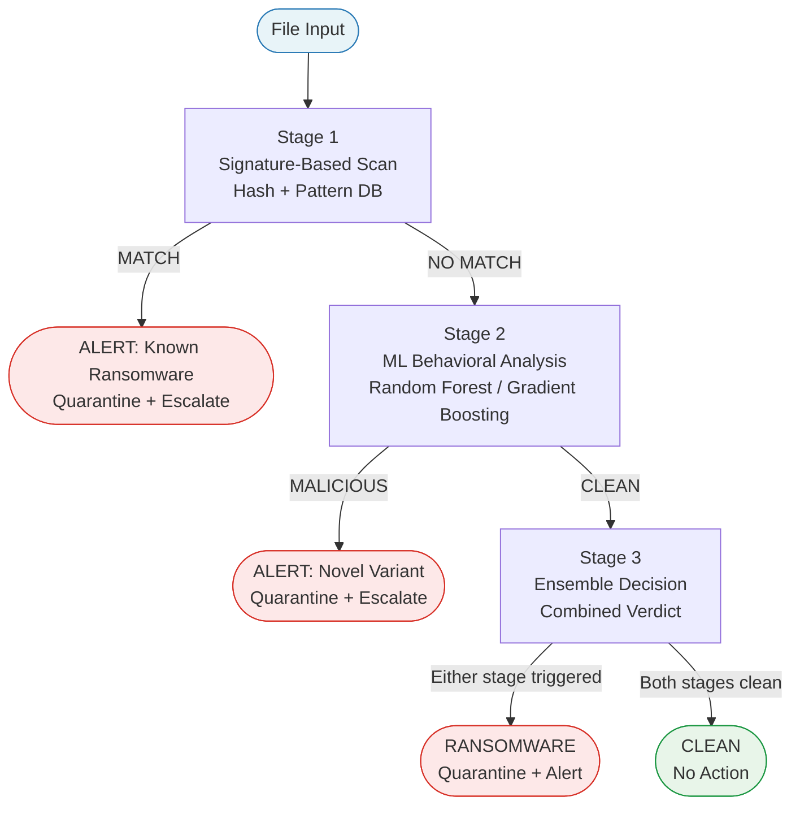

# Detection Pipeline — Architecture Diagram

## Stage Summary

| Stage | Method | Triggers On |
|---|---|---|
| Stage 1 | Signature Scan | Known ransomware hash or pattern match |
| Stage 2 | ML Behavioral Analysis | Novel or zero-day variants via feature classification |
| Stage 3 | Ensemble Decision | Either stage flagging — minimises missed detections |

## Behavioral Features Fed into Stage 2

- File entropy — high entropy signals active encryption
- File rename and extension change rate
- API call sequences (`CryptEncrypt`, `FindFirstFile` loops)
- Registry modifications and shadow copy deletion
- Network communication patterns (C2 indicators)
